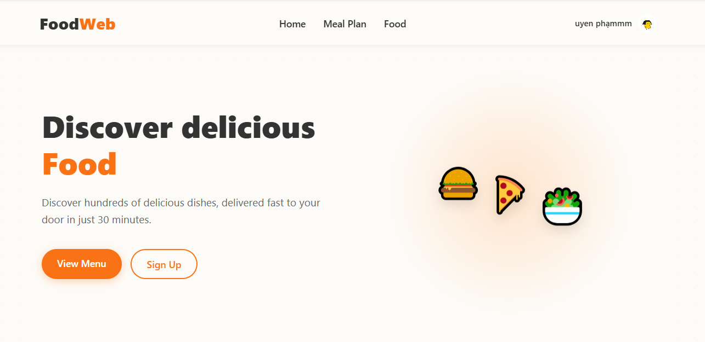
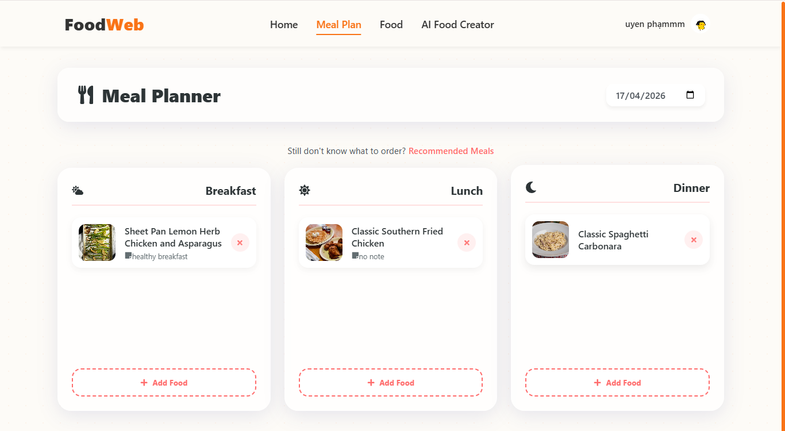
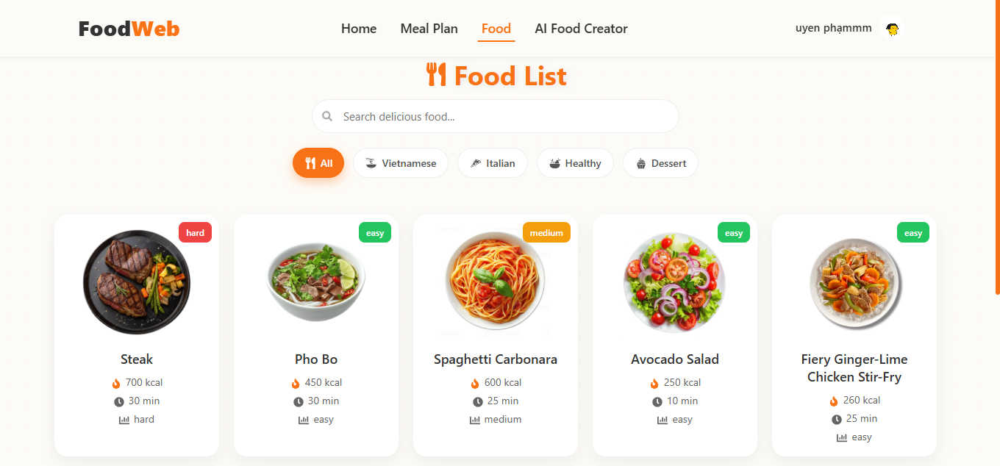

# 🍽️ FoodWeb - Meal Planning Web Application

**FoodWeb** is a full-stack web application designed to help users plan meals, explore recipes, and track their cooking habits. The system allows users to organize daily meals, save favorite foods, and monitor their interactions to support future recommendations.

---

## 🏠 Home Page


## 📅 Meal Plan Page


## 🍲 Food Detail Page


---

## 🚀 Features

### 👤 User Features

* User authentication (login/register)
* View and update profile information
* Save favorite foods
* Track food interaction history

### 🍽️ Food Management

* Browse food list
* View detailed food information
* Search foods by name
* Filter foods by category
* Pagination support

### 📅 Meal Planning

* Create daily meal plans
* Add foods to meal plans
* Organize meals by Breakfast, Lunch, and Dinner
* Update or remove meal items
* Automatically track history when meals are added

### ❤️ Favorites

* Add foods to favorites
* Remove foods from favorites
* View favorite food list

### 📊 Food History Tracking

* Automatically record:

  * Cooked foods
  * Liked foods
  * Skipped foods
* Store user behavior for future recommendations

---

## 🛠️ Tech Stack

**Frontend:**

* ReactJS
* Redux Toolkit
* React Router
* Axios
* CSS

**Backend:**

* Java
* Spring Boot
* Spring Data JPA
* RESTful APIs

**Database:**

* MySQL

**Tools:**

* Git & GitHub
* Postman
* VS Code
* IntelliJ IDEA

---

## 🏗️ System Architecture

The frontend (ReactJS) communicates with the backend (Spring Boot) through RESTful APIs. The backend handles business logic and interacts with a MySQL database.

---

## 🗄️ Database Design

**Main Tables:**
users, foods, ingredients, food_ingredients, meal_plans, meal_plan_items, favorite_foods, user_food_history, user_preferences

**Key Relationships:**

* One user → many meal plans
* One meal plan → many meal items
* Foods ↔ Ingredients (Many-to-Many)
* Users ↔ Favorite Foods (Many-to-Many)

---

## 🔌 API Overview

### Meal Plan APIs

* GET `/api/meal-plans?date=YYYY-MM-DD`
* POST `/api/meal-plans`
* PUT `/api/meal-plans/{itemId}`
* DELETE `/api/meal-plans/{itemId}`

**Example request body (POST):**

```json
{
  "foodId": 1,
  "date": "2026-04-15",
  "mealType": "Breakfast",
  "note": "Healthy meal"
}
```

### Food APIs

* GET `/api/foods`
* GET `/api/foods/{id}`
* GET `/api/foods/search?keyword=chicken`

### Favorite APIs

* POST `/api/favorites/{foodId}`
* DELETE `/api/favorites/{foodId}`
* GET `/api/favorites`

---
## 📂 Project Structure  

### Backend (Spring Boot)
```
foodweb_be/
├── controller
├── service
├── repository
├── entity
├── dto
├── enums
└── config
```

### Frontend (ReactJS)
```
foodweb_fe/
├── src/
│   ├── features/
│   │   ├── food/
│   │   ├── meal/
│   │   ├── favorite/
│   │   └── history/
│   ├── components/
│   ├── pages/
│   └── store/
```


## ⚙️ Installation Guide

**Backend:**

```bash
cd foodweb_be
mvn clean install
mvn spring-boot:run
```

Runs at: http://localhost:8080

**Frontend:**

```bash
cd foodweb_fe
npm install
npm run dev
```

Runs at: http://localhost:5173

---

## 📊 Key Highlights

* Designed a relational database with multiple relationships
* Built RESTful APIs using Spring Boot
* Developed a dynamic UI with ReactJS and Redux Toolkit
* Implemented automatic user history tracking
* Built reusable and scalable components
* Developed a flexible meal planning system

---

## 🔮 Future Improvements

* Food recommendation system
* Nutrition tracking (calories)
* Weekly meal planning view
* Admin dashboard
* AI-based meal suggestions

---

## 👩‍💻 Author

Pham Thi Phuong Uyen

Email: [puyen274@gmail.com](mailto:puyen274@gmail.com)
GitHub: https://github.com/phuyen27
